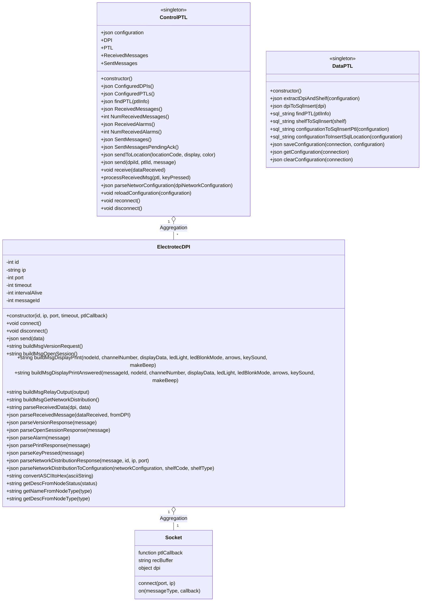
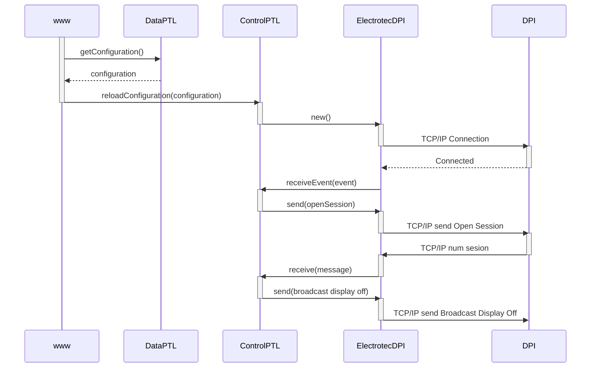
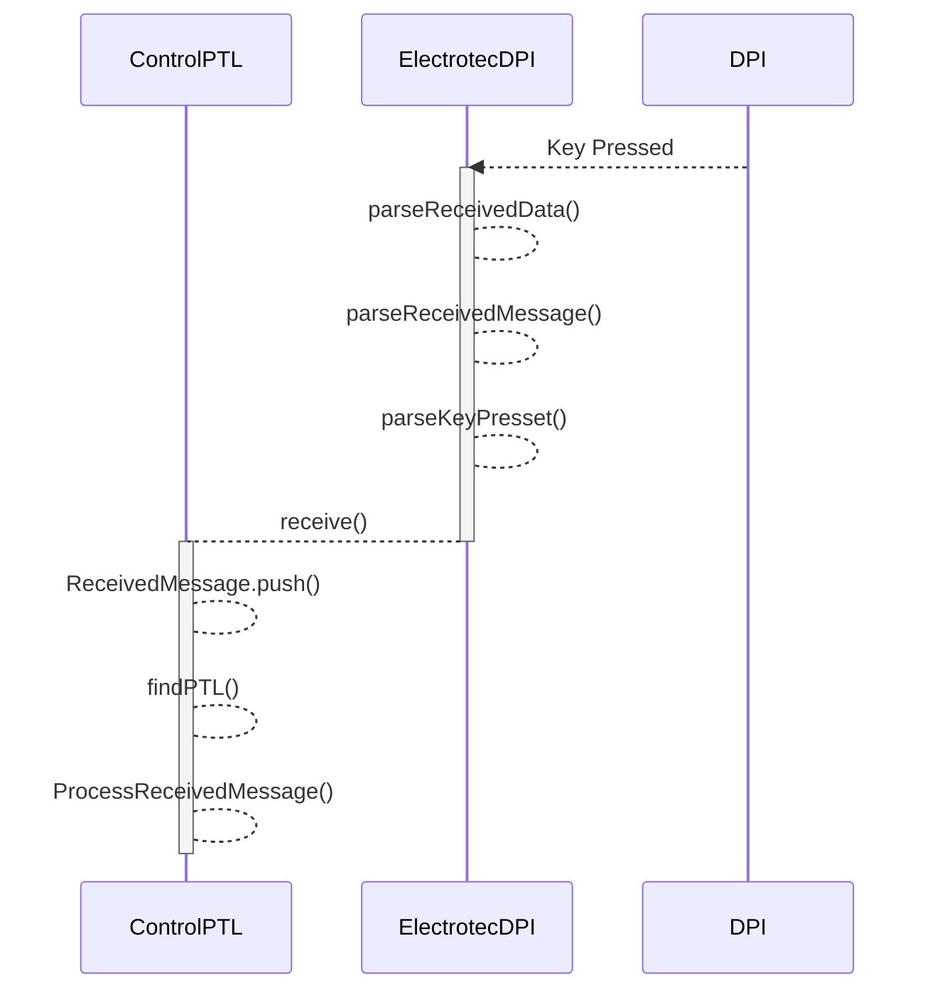

# onion-ptl-service

Pick to light control service for Electrotec S.L. devices

The purpose of this repository is to provide a service capable of controlling an Electrotec PTL installation, offering basic operations that can be adapted to future requirements.

## Table of contents

## Requirements and Architecture

### Interfaces

The service must be able to interact with the following systems:

1. Electrotec PTLs: two-way communication, sending the data to be displayed on the PTL and receiving events triggered by operators (keys pressed)
2. Onion Warehouse Managemt Software (OnionWMS): two-way communication, receiving movements to be confirmed by operators on PTLs and sending actions taken by operators
3. Third party software (Enterprise Resource Planning or Warehouse Management Softwares): Two-way communication at the level of preparation orders with multiple lines, being able to receive the orders via file or REST API and being able to obtain the result of the preparation through the same channel.

### Service modules

The service consists of the following modules:

1. Communication module with the Electrotec PTLs: implements the specifics of communication and receives PTL events
2. Connection module with the DB: stores the configuration and the messages received and sent
3. Communication API with Onion and external systems interfaces
4. Specific control modules for each operation
5. PTL control module that coordinates messages received from Onion and external systems, events received from PTLs and decides how to act by calling the specific module for each operation

### Some class diagrams



### Some sequence diagrams

Inici de l'aplicació



Recepció de tecla premuda des de DPI



## Some rules for working with Electrotec PTLs

1. You must not send two messages to the same PTL in a row without leaving 100 millis between one and the other, because the second one can be lost. For example, you must avoid turning off the PTL and sending it a new message, in which case it would not be necessary to turn it off.
2. Whenever you want to work with messages with ACK, you must open a session first.
3. You don't need to keep the DPI connection alive as did the old C# library. The library does it by pinging, but you don't need to if using TCP/IP.
4. The Electrotec DPI does not respond to PINGs

## Service installing process

How to install service with pm2 on a Ubuntu LTS?

- Install MySQL, NodeJS, npm and pm2
- Deploy the service on the client machine by cloning this repository
- Install third-party libraries with `npm install` or `npm install --production`
- Create the DB by running the script `mysql < script/database-onion-ptl.sql`
- Create a basic default configuration by running `mysql onion_ptl < script/export-database-test.sql`
- Create the configuration file from the example file `cp config/config.example.js config/config.js` and edit to set the specific configuration values.
- Start the service to test it works `npm start` or `NODE_ENV=production npm start`
- Create the pm2 service running `PORT=3100 NODE_ENV=production pm2 start ./bin/www --name OnionPTL`

## How to connect with the Electrotec S.L. DPI Admin Web Page

Get the DPI IP, for example: 192.168.1.222

Open a web browser and connect to DPI, with the user: admin / PASSWORD

Browsing through the pages you can see:

HOME PAGE

```text
DPI - Current settings
Firmware version: 2.6
Network settings:
IP: 192.168.1.222
Netmask: 255.255.255.0
Gateway: 192.168.1.222

Channel settings:

Channel 1 - Active: Yes    Channel 1 - Nodes Configured: 5
Channel 2 - Active: Yes    Channel 2 - Nodes Configured: 5
```

CHANNEL 1 PAGE

```text
Node status table
1 (DP) 2 (DP) 3 (DP) 4 (DP) 5 (Interface)
```

CHANNEL 2 PAGE

```text
Node status table
1 (Interface) 2 (LC) 3 (LC) 4 (Error) 5 (LC)
```

## Changelog

### V 0.1.0

- Electrotec PTL communications protocol implementation: MAN-004-07 of 06/19/2015
- Implementation API communications with Onion
- Movement management API implementation

## License

Copyright (c) 2023 Code Biting S.L. Licensed under the Apache 2.0 License.
